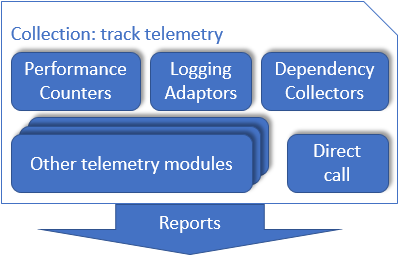
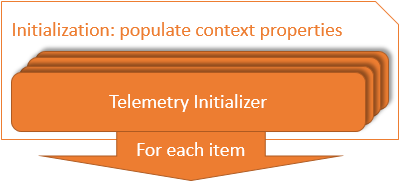
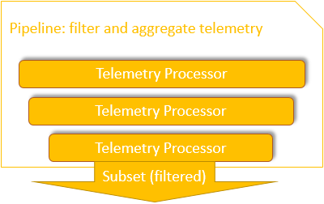
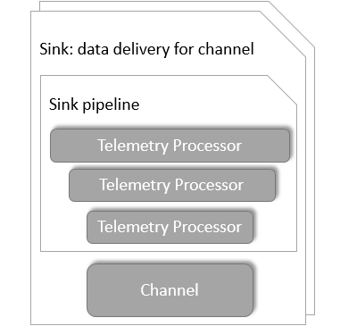

[](https://mseng.visualstudio.com/AppInsights/_build/latest?definitionId=6237?branchName=develop)
[](https://mseng.visualstudio.com/AppInsights/_build/latest?definitionId=1822?branchName=develop)

## NuGet packages

- [Microsoft.ApplicationInsights](https://www.nuget.org/packages/Microsoft.ApplicationInsights/)
[](https://www.nuget.org/packages/Microsoft.ApplicationInsights/)
- [Microsoft.ApplicationInsights.WindowsServer.TelemetryChannel](https://www.nuget.org/packages/Microsoft.ApplicationInsights.WindowsServer.TelemetryChannel)
[](https://www.nuget.org/packages/Microsoft.ApplicationInsights.WindowsServer.TelemetryChannel/)

# Application Insights for .NET

This repository has code for the base .NET SDK for Application Insights. [Application Insights][AILandingPage] is a service that allows developers ensure their application are available, performing, and succeeding. This SDK provides the base ability to send all Application Insights types from any .NET project. 

## Getting Started

If developing for a .Net project that is supported by one of our platform specific packages, [Web][WebGetStarted] or [Windows Apps][WinAppGetStarted], we strongly recommend to use one of those packages instead of this base library. If your project does not fall into one of those platforms you can use this library for any .Net code. This library should have no dependencies outside of the .Net framework. If you are building a [Desktop][DesktopGetStarted] or any other .Net project type this library will enable you to utilize Application Insights. More on SDK layering and extensibility [later](#sdk-layering).

### Get an Instrumentation Key

To use the Application Insights SDK you will need to provide it with an Instrumentation Key which can be [obtained from the portal][AIKey]. This Instrumentation Key will identify all the data flowing from your application instances as belonging to your account and specific application.

### Add the SDK library

We recommend consuming the library as a NuGet package. Make sure to look for the [Microsoft.ApplicationInsights][NuGetCore] package. Use the NuGet package manager to add a reference to your application code. 

### Initialize a TelemetryClient

The `TelemetryClient` object is the primary root object for the library. Almost all functionality around telemetry sending is located on this object. You must initialize an instance of this object and populate it with your Instrumentation Key to identify your data.

```C#
using Microsoft.ApplicationInsights;

var tc = new TelemetryClient();
tc.InstrumentationKey = "INSERT YOUR KEY";
```

### Use the TelemetryClient to send telemetry

This "base" library does not provide any automatic telemetry collection or any automatic meta-data properties. You can populate common context on the `TelemetryClient.context` property which will be automatically attached to each telemetry item sent. You can also attach additional property data to each telemetry item sent. The `TelemetryClient` also exposes a number of `Track...()` methods that can be used to send all telemetry types understood by the Application Insights service. Some example use cases are shown below.

```C#
tc.Context.User.Id = Environment.GetUserName(); // This is probably a bad idea from a PII perspective.
tc.Context.Device.OperatingSystem = Environment.OSVersion.ToString();

tc.TrackPageView("Form1");

tc.TrackEvent("PurchaseOrderSubmitted", new Dictionary<string, string>() { {"CouponCode", "JULY2015" } }, new Dictionary<string, double>() { {"OrderTotal", 68.99 }, {"ItemsOrdered", 5} });
	
try
{
	...
}
catch(Exception e)
{
	tc.TrackException(e);
}
``` 

### Ensure you don't lose telemetry

This library makes use of the InMemoryChannel to send telemetry data. This is a very lightweight channel implementation. It stores all telemetry to an in-memory queue and batches and sends telemetry. As a result, if the process is terminated suddenly, you could lose telemetry that is stored in the queue but not yet sent. It is recommended to track the closing of your process and call the `TelemetryClient.Flush()` method to ensure no telemetry is lost.

### Full API Overview

Read about [how to use the API and see the results in the portal][api-overview].

## SDK layering

This repository builds two packages - `Microsoft.ApplicationInsights` and `Microsoft.ApplicationInsights.WindowsServer.TelemetryChannel`. These packages define public API, reliable channel to Application Insights back-end and [data reduction code](https://msdn.microsoft.com/magazine/mt808502) like metrics pre-aggregation and sampling. Data collection, enrichment and filtering implemented as separate NuGet packages. These separate NuGet packages are using extensibility points explained below.

Application Insights SDK defines the following layers: data collection, public API, telemetry initialization and enrichment, data reduction pipeline and finally - telemetry sink. 

**Data collection** layer represented by various telemetry modules - officially supported and community created. Each module converts events exposed by platform like ASP.NET into Application Insights data model. For example, dependency collection telemetry module subscribes on `begin` and `end` events of `System.Net.HttpClient` and calls `TrackDependency` API. This module knows how to collect dependency name, target, and [other properties](https://docs.microsoft.com/azure/application-insights/application-insights-data-model-dependency-telemetry) from those `begin` and `end` events.

**Telemetry initialization and enrichment** allows to modify telemetry items. There are two typical scenarios for the enrichment. First - stamp every telemetry item with the platform or application specific [context](https://docs.microsoft.com/azure/application-insights/application-insights-data-model-context). Examples may be application version, user id or flighting name for A/B testing. Second scenario is re-writing properties of the telemetry data collected automatically. For instance, dependency collection telemetry module collects the http dependency name as a url path and telemetry initializer may change this behavior for well-known urls.

**Data reduction pipeline** is a linked list of telemetry processors. Each telemetry processor may decide to pre-aggregate and filter telemetry item or pass it to the next processor. This way only interesting telemetry reaches to the end of the pipeline and being send to the telemetry sinks.

Each **Telemetry sink** is responsible to upload telemetry to the specific back-end. Default telemetry sink sends data to the Application Insights. Sinks may also differ in guarantees they provide while uploading to the same back end. One may implement reliable delivery with re-tries and persistence when another may implement send and forget type of upload. Every telemetry sink may have it's own pipeline for additional data filtering and pre-aggregation. 

Set of telemetry initializers called synchronously for every telemetry item. So extra properties can be added to the item. 
By this time telemetry item is fully initialized. Build pipeline to aggregate or filter telemetry. 
Set of telemetry sinks to upload data in various back-ends. Every sink has it's own pipeline for extra filtering and data aggregation.

Here is the diagram of Application Insights SDK layering and extensibility points:

| Layer                											| Extensibility   					|
|---------------------------------------------------------------|-----------------------------------------------|
|  		| Pick one of existing [modules](https://docs.microsoft.com/azure/application-insights/app-insights-configuration-with-applicationinsights-config#telemetry-modules-aspnet) <br> or manually instrument code |
|  		| Track [custom operations](https://docs.microsoft.com/azure/application-insights/application-insights-custom-operations-tracking) <br> and other [telemetry](https://docs.microsoft.com/azure/application-insights/app-insights-api-custom-events-metrics) |
|  | Pick [telemetry initializers](https://docs.microsoft.com/azure/application-insights/app-insights-configuration-with-applicationinsights-config#telemetry-initializers-aspnet) <br> or create your [own](https://docs.microsoft.com/azure/application-insights/app-insights-api-filtering-sampling#add-properties-itelemetryinitializer) |
|  			| Configure [sampling](https://docs.microsoft.com/azure/application-insights/app-insights-sampling), <br> create [filtering](https://docs.microsoft.com/azure/application-insights/app-insights-api-filtering-sampling#filtering-itelemetryprocessor) telemetry processor <br> or strip out confidential data |
|  					|  For the default sink: <br> Use built-in channel or <br> use [server channel](https://www.nuget.org/packages/Microsoft.ApplicationInsights.WindowsServer.TelemetryChannel/) for reliable delivery. <br> Configure [EventFlow](https://github.com/Azure/diagnostics-eventflow) to upload telemetry <br> to ElasticSearch <br> Azure EventHub and <br> and more |

Packages like `Microsoft.ApplicationInsights.Web` or `Microsoft.ApplicationInisghts.AspNetCore` install a set of telemetry modules, telemetry initializers and default sinks that works for the most scenarios. However SDK is designed to be flexible so you can pick and choose components on every layer for the best telemetry data for your application.  

## Branches

- [master][master] contains the *latest* published release located on [NuGet][NuGetCore].
- [develop][develop] contains the code for the *next* release. 

## Contributing

We strongly welcome and encourage contributions to this project. Please read the general [contributor's guide][ContribGuide] located in the ApplicationInsights-Home repository and the [contributing guide](https://github.com/Microsoft/ApplicationInsights-dotnet/blob/develop/.github/CONTRIBUTING.md)  for this SDK. If making a large change we request that you open an [issue][GitHubIssue] first. We follow the [Git Flow][GitFlow] approach to branching. 

This project has adopted the [Microsoft Open Source Code of Conduct](https://opensource.microsoft.com/codeofconduct/). For more information see the [Code of Conduct FAQ](https://opensource.microsoft.com/codeofconduct/faq/) or contact [opencode@microsoft.com](mailto:opencode@microsoft.com) with any additional questions or comments.

[AILandingPage]: http://azure.microsoft.com/services/application-insights/
[api-overview]: https://azure.microsoft.com/documentation/articles/app-insights-api-custom-events-metrics/
[ContribGuide]: https://github.com/Microsoft/ApplicationInsights-Home/blob/master/CONTRIBUTING.md
[GitFlow]: http://nvie.com/posts/a-successful-git-branching-model/
[GitHubIssue]: https://github.com/Microsoft/ApplicationInsights-dotnet/issues
[master]: https://github.com/Microsoft/ApplicationInsights-dotnet/tree/master
[develop]: https://github.com/Microsoft/ApplicationInsights-dotnet/tree/development
[NuGetCore]: https://www.nuget.org/packages/Microsoft.ApplicationInsights
[WebGetStarted]: https://azure.microsoft.com/documentation/articles/app-insights-start-monitoring-app-health-usage/
[WinAppGetStarted]: https://azure.microsoft.com/documentation/articles/app-insights-windows-get-started/
[DesktopGetStarted]: https://azure.microsoft.com/documentation/articles/app-insights-windows-desktop/
[AIKey]: https://github.com/Microsoft/ApplicationInsights-Home/wiki#getting-an-application-insights-instrumentation-key
